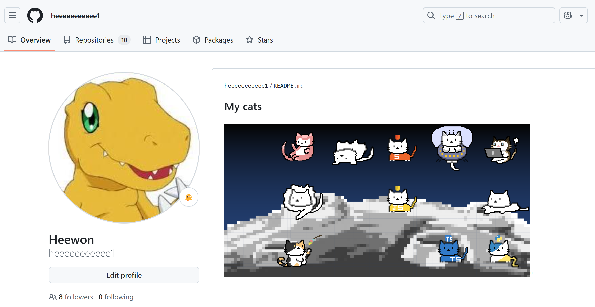

# 

### 알고리즘 풀고 키우는 나만의 고양이!😺
#### 알고리즘을 풀어서 포인트를 모으고,  귀여운 고양이 캐릭터를 뽑아 나만의 특별한 이미지를 만들어보세요.

 

 

### 🪙 냥코인 모으기 

- 냥코인은 `solved.ac`의 알고리즘 문제를 풀어 얻을 수 있어요.
- 문제의 티어가 높을수록 더 많은 냥코인을 획득할 수 있습니다.

 

### 🎲 고양이 수집

- 열심히 모은 냥코인으로 귀여운 고양이 캐릭터를 뽑아보세요.
- 내가 뽑은 고양이는 내 정보 페이지에서 확인할 수 있습니다.
- 등급별로 다양한 종류의 고양이들을 만날 수 있습니다!

 

### 🛒 고양이 판매

- 상점에서 내가 모은 고양이를 판매하고 추가 냥코인을 적립하세요.
- 판매한 냥코인으로 더 귀여운 고양이를 모아보세요!

 

### 🐈 깃허브 리드미 꾸미기

- 내 정보 페이지에서 내가 모은 고양이들 중에 원하는 고양이들만 골라 나만의 이미지를 만들어보세요!
- 내가 만든 이미지는 링크를 복사해서 깃허브 리드미를를 꾸밀 수 있어요.

- 나만의 고양이 컬렉션을 자랑하고 특별한 개성을 표현해보세요!

